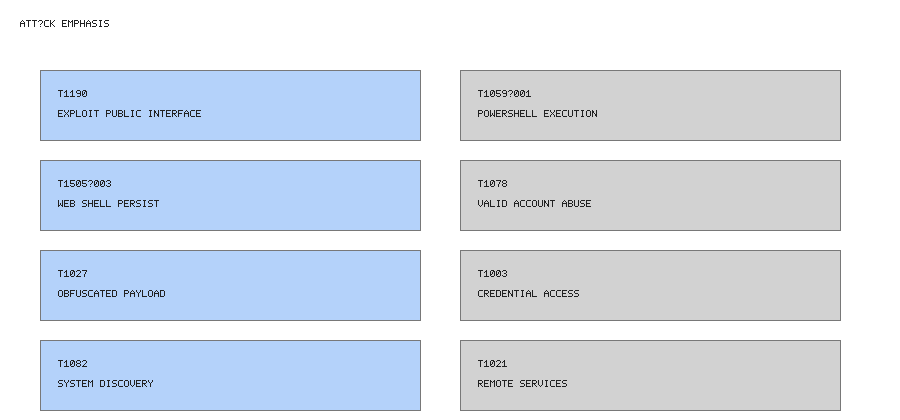

# Incident Micro-Postmortem — Microsoft SharePoint (On-Prem) “ToolShell” Campaign
This kit triages the mid-2025 “ToolShell” zero-day campaign against **on-premises** Microsoft SharePoint Server; SharePoint Online is out of scope. It delivers end-to-end reproducible hunts, comms, and figures without relying on external data.

**Why this repo exists:** accelerate analyst triage with reproducible detections and aligned executive communications.

## Scope and Assumptions
- On-prem Microsoft SharePoint Server only.
- Likely attack flow: internet-exposed SharePoint/IIS → crafted deserialization/ViewState abuse → webshell deployment → potential machineKey/ValidationKey theft → token forgery → RCE/lateral movement.
- Synthetic, illustrative data only; no real organizational telemetry or proprietary IOCs.

## ATT&CK Snapshot
Techniques emphasized: T1190 (Exploit Public-Facing Application), T1059.001 (PowerShell), T1505.003 (Web Shell), T1078 (Valid Accounts), T1027 (Obfuscated/Complicated Files), T1003 (OS Credential Dumping), T1082 (System Information Discovery), T1021 (Remote Services), T1071 (Application Layer Protocol), T1567 (Exfiltration Over Web Services).

## Logs That Matter (Table)
| Phase | Signal | Log Source | Key Fields | Example Pattern |
| --- | --- | --- | --- | --- |
| Web tier/IIS | Long `__VIEWSTATE` blobs, unusual POSTs to `/_layouts/*`, rare UAs, 500/404 bursts | IIS/W3C logs, SharePoint ULS | `cs-uri-stem`, `cs-useragent`, `sc-status`, payload length | Spikes of large POST bodies followed by 500 errors |
| Process exec | `w3wp.exe -> cmd.exe -> powershell.exe` with `-enc` or `-EncodedCommand` | Windows Security 4688 | `ParentProcessName`, `NewProcessName`, `CommandLine`, `Account` | `C:\Windows\System32\inetsrv\w3wp.exe` spawning PowerShell with encoded payload |
| File create/webshell | Unexpected `.aspx` drops under `\inetpub\wwwroot\wss\...` or `\_layouts\...` | Sysmon 11 / File integrity feeds | `TargetFilename`, `Image`, `Hashes` | New `.aspx` in `\inetpub\wwwroot\wss\VirtualDirectories\80\App_Data\` |
| Identity/token | Abnormal session issuance, admin actions traced to service accounts | SharePoint ULS, AD FS logs | `User`, `ClientIP`, `CorrelationId`, token claims | Service account issuing multiple high-privilege tokens |
| DNS/Proxy | Newly-seen low-prevalence domains after IIS anomalies | DNS, proxy, firewall logs | `query`, `src_ip`, `count`, prevalence scores | First-seen domain resolving shortly after PowerShell execution |

## Run These Hunts Now
- [`hunts/w3wp_powershell_encodedcommand.kql`](hunts/w3wp_powershell_encodedcommand.kql) · [`SPL`](hunts/w3wp_powershell_encodedcommand.spl) · [`Sigma`](hunts/w3wp_powershell_encodedcommand.sigma.yaml): Catch encoded PowerShell spawned from IIS worker.
- [`hunts/sharepoint_webshell_filecreate.kql`](hunts/sharepoint_webshell_filecreate.kql) · [`SPL`](hunts/sharepoint_webshell_filecreate.spl) · [`Sigma`](hunts/sharepoint_webshell_filecreate.sigma.yaml): Identify unexpected `.aspx` files within SharePoint web roots.
- [`hunts/dns_newly_seen_post_iis_anomaly.kql`](hunts/dns_newly_seen_post_iis_anomaly.kql) · [`SPL`](hunts/dns_newly_seen_post_iis_anomaly.spl) · [`Sigma`](hunts/dns_newly_seen_post_iis_anomaly.sigma.yaml): Surface low-prevalence DNS domains following IIS anomalies and suspicious IIS child processes.

## How To Reproduce On This Repo
- Review `samples/example_events.json` for representative Windows Security 4688, Sysmon 11, and DNS entries aligned to each hunt (benign noise included).
- Expected outputs (abridged):
  - PowerShell spawn hunt: `Account` of the app pool service account, `CommandLine` containing `-enc`, with 3 malicious hits and 1 benign admin script note.
  - Webshell file create hunt: aggregation showing 2 `.aspx` paths under `\inetpub\wwwroot\wss\VirtualDirectories\80\Layouts\` during the attack hour and a benign deployment entry.
  - DNS newly-seen hunt: domains `cdn-msupdate.example`, `toolshare-sync.example` tied to the IIS host IP with `<5` total queries in 24h plus one benign corporate CDN domain ignored by thresholding.
- False-positive tuning: align allowlists to documented admin automation windows, deployment change tickets, known CDN domains, and scripted maintenance tasks. Adjust time bins and prevalence thresholds based on platform norms; track service account behavior via baseline comparisons.

## First 4 Hours — Comms Plan
- See `comms/first_4h.md` for ready-to-send templates and placeholders.
- Cadence: T+0–30 triage notification (stakeholders aligned), T+30–120 hourly scoping stand-ups, T+120–240 containment status plus executive brief aligned to the decision tree.
- Decision tree visual: `figures/decision-tree.png` mirrors the ASCII logic in the comms pack.

## Falsifiability and Limitations
- If IIS app pool automation legitimately launches PowerShell with encoded scripts (e.g., DevOps tooling), the PowerShell hunt will trigger; maintain maintenance allowlists and track known automation accounts.
- Rapid attacker cleanup or alternative tooling (e.g., unmanaged CLR webshells, C# assemblies) may evade file creation telemetry, especially if Sysmon coverage is incomplete or tamper-prone.

## Future Work (Optional)
- AppSec guardrails for SharePoint-adjacent apps: secret scanning for machine keys, CI checks for dangerous deserialization patterns, and web-root integrity monitoring during build pipelines.

## Sources (Non-quoted, general references)
- Microsoft security guidance on SharePoint Server (on-prem scope clarifications)
- NVD CVEs for mid-2025 SharePoint on-prem vulnerabilities
- CISA mid-2025 SharePoint advisories/MALWAR
- Vendor research: Unit 42, SentinelOne, Trend Micro incident reports

## Next Actions (Human)
- Replace “Sources” bullets with precise links (e.g., Microsoft, MSRC, NVD, CISA, trusted vendor write-ups).
- Optionally substitute organization-safe telemetry or extend samples with local lab events.
- Execute and tune these hunts in production SIEM/EDR, adding allowlists for automation, change windows, and trusted CDNs.
- Capture lessons learned in internal runbooks and monitor SharePoint farm for recurring anomalies; keep PDF/social deliverables explicitly out of scope for this kit.
- Consider building an AppSec guardrails demo repo and referencing it under “Future Work.”

## After-Build Notes — How to Adapt to Live SIEM/EDR
- Update index/table names (`index=*`, `SecurityEvent`, `Sysmon`) to match local data models (e.g., `m365:security`, `wineventlog`).
- Replace placeholder fields (`Account`, `ClientIP`, `TargetFilename`) with environment-specific aliases or normalized schemas (e.g., `user`, `ip_src`, `file_path`).
- Confirm timezone alignment; adjust `ago(24h)` or earliest windows to match fleet retention and detection latency.
- Embed environment-specific allowlists (service accounts, deployment hosts) to reduce noise while preserving attacker coverage.

